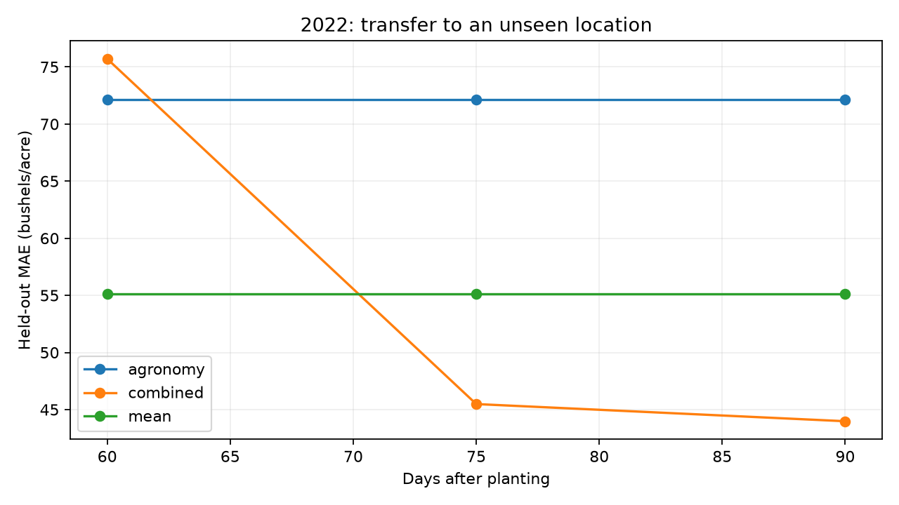
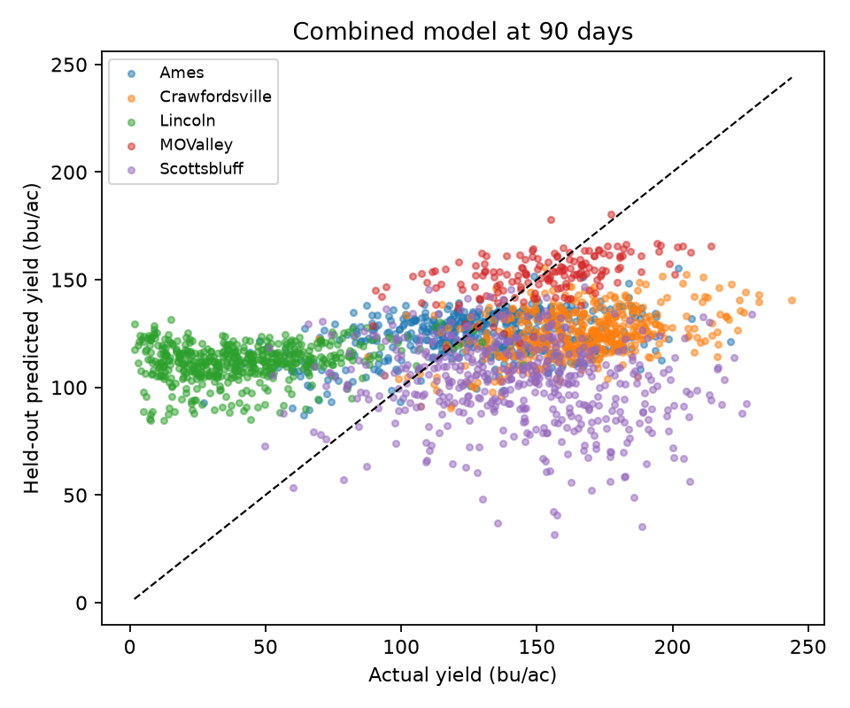

# Maize yield evaluation

2022 historical replay: five held-out-location folds.

Units: bushels/acre at 15.5% moisture. Results test spatial transfer in 2022, not future-season accuracy.

| Cutoff | Agronomy MAE | Combined MAE | Improvement (%) | Combined precision@K |
|---|---|---|---|---|
| 60 | 72.12 | 75.70 | -5.0 | 44.2% |
| 75 | 72.12 | 45.48 | 36.9 | 45.6% |
| 90 | 72.12 | 43.98 | 39.0 | 42.3% |

Scouting precision uses a 10% per-site budget by default and the lowest-yielding 20% as retrospective targets. Ties use plot ID for reproducibility.
Overall errors are plot-weighted; within-site Spearman is the unweighted mean of defined site correlations.
No automatic trustworthy cutoff is declared: operational error tolerance and future-season validation remain necessary.
At 60 days Missouri Valley lacks satellite coverage. Missing imagery is retained, not silently dropped.
Scouting identifies predicted low yield, not confirmed remediable stress. Hybrid rankings are conditional predictions, not causal genetic comparisons.